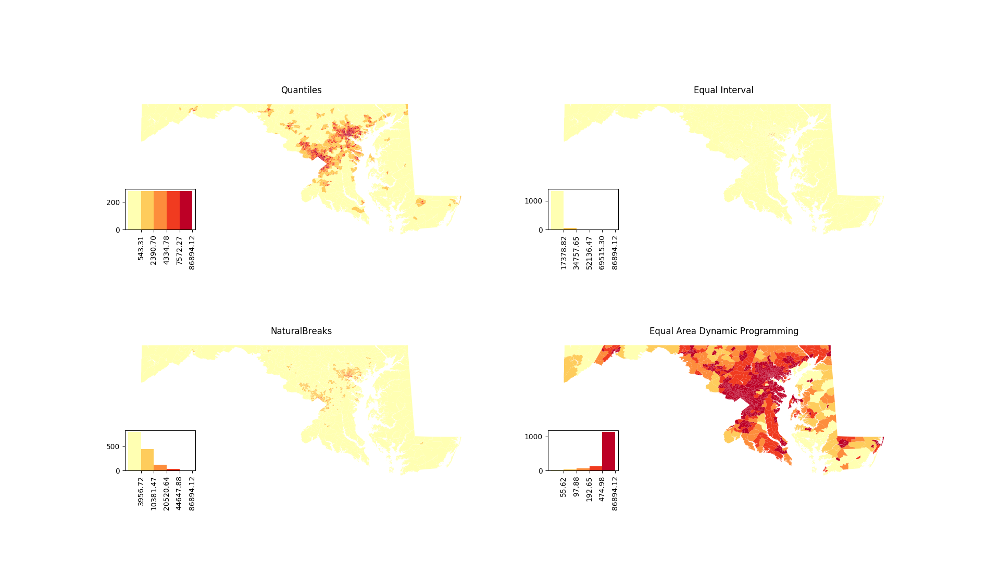

# Equal Area Breaks

Equal area breaks, occasionally known as geographic quantiles, is a data
classification method for choropleth maps that ensures the total area of each
class is approximately equal. This package provides algorithms to compute this
classification and integrates the algorithms with [mapclassify][1] so that it
can be used with the full [pysal][2] package suit.

The algorithms implemented in this package are from not yet published paper
[Equal-area Breaks: A Classification Scheme for Data to Obtain an Evenly-colored Choropleth Map][3]

## Package Usage

Example usage of this package is show in the `demo` directory. The demos require,
in addition to this package, geopandas, descartes, and matplotlib. Execute the
following to install these packages.

```
pip install . geopandas matplotlib descartes
```

You should then be able to execute the demo python scripts.

```
cd demos
python world_gdp.py
```

The second example uses a data file that does not come packaged with geopandas.
The data for this example is [Maryland census data][4] from 2010.  To run this
example, you will need to first unzip the archive in the data directory.

```
cd demos/data
unzip Maryland_Census_Data__Census_Tracts.zip
cd ..
python maryland_population.py
```

## Example Maps

To save you the trouble of installing everything, here are some sample maps
generated by the demo scripts. All maps are presented with a histogram legend
to show the distribution of objects into classes. Note how this is often
different from the perceived distribution of classes based on the geographic cover
of classes on the map.

In both images, the first three example maps are classifications provided by
map classify that serve as a point of comparison. The last map is the optimal
equal area classification provided by this package.




[1]: https://pysal.org/mapclassify/
[2]: https://pysal.org/pysal/
[3]: https://www.cs.umd.edu/sites/default/files/scholarly_papers/Abboud.pdf
[4]: https://data.imap.maryland.gov/datasets/maryland-census-data-census-tracts
