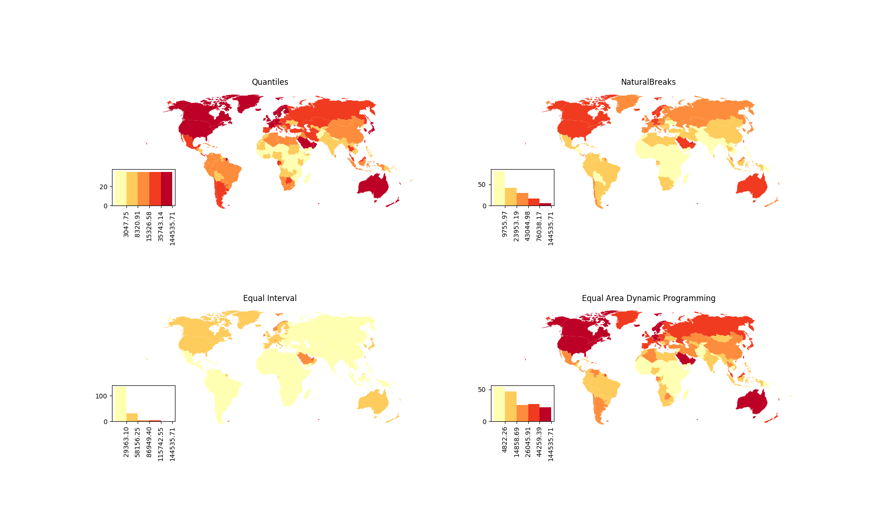

# Equal Area Breaks

Equal area breaks, occasionally known as geographic quantiles, is a data
classification method for choropleth maps that ensures the total area of each
class is approximately equal. This package provides algorithms to compute this
classification and integrates the algorithms with [mapclassify][1] so that it
can be used with the full [pysal][2] package suit.

In addition to the straight forward equal area classification, this package
also provides an algorithm that that attempts to balance equalizing **area**
per class with equalizing **objects** per class. This approach is termed the
weighted algorithm because it takes as an additional parameter a weight `W`
that defines how much each criteria should be favored. Setting `W=0` is
equivalent an equal area classification while `W=1` is equivalent to quantiles.

The algorithms implemented in this package are from not yet published paper
[Equal-area Breaks: A Classification Scheme for Data to Obtain an Evenly-colored Choropleth Map][3]

## Package Usage

Example usage of this package is show in the `demo` directory. The demos require,
in addition to this package, geopandas, descartes, and matplotlib. Execute the
following to install these packages.

```
pip install . geopandas matplotlib descartes
```

You should then be able to execute the demo python scripts.

The first example plots global GDP per capita using a data set that is bundled
with geopandas. Executing the demo script will open a matplotlib window showing
the same data plotted using quantiles, natural breaks, equal intervals, and
equal area classification methods. The first three are provided by mapclassify
while the last technique is implemented by this package.

```
cd demos
python world_gdp.py
```



The second example uses a data file that does not come packaged with geopandas.
The data for this example is [Maryland census data][4] from 2010. The data is
used to plot population density in the state of Maryland. To run this example,
you will need to first unzip the archive in the data directory. The
classification techniques compared are the same as the first example.

```
cd demos/data
unzip Maryland_Census_Data__Census_Tracts.zip
cd ..
python maryland_population.py
```


Finally, the last usage examples showcases the weighted equal area algorithm.
Using the same data as the previous example, the classification is demonstrated
for `W=0, 0.25, 0.50, 0.75, 1.00`. Since this examples relies on the Maryland
census data, the data must be unziped if you have not done so already.

```
cd demos/data
unzip Maryland_Census_Data__Census_Tracts.zip
cd ..
pyhton weighted_maryland_population.py
```


[1]: https://pysal.org/mapclassify/
[2]: https://pysal.org/pysal/
[3]: https://www.cs.umd.edu/sites/default/files/scholarly_papers/Abboud.pdf
[4]: https://data.imap.maryland.gov/datasets/maryland-census-data-census-tracts
